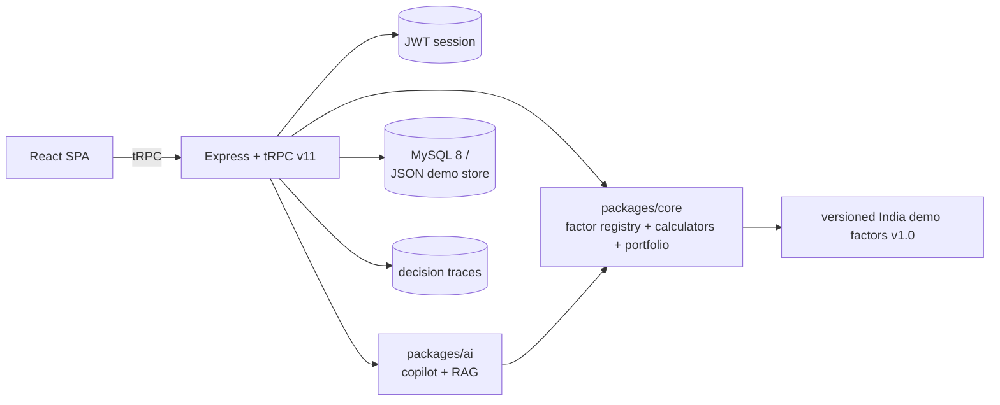

# TerraMind AI

**An explainable intervention-planning copilot for campuses, campuses, factories, and institutional sites.**

TerraMind AI helps a campus, apartment portfolio, small factory, office, village, or
municipal team choose an implementable bundle of sustainability actions — using local
data, explicit assumptions, evidence-linked calculations, uncertainty ranges, and
stakeholder priorities. The AI *explains and orchestrates*; the deterministic engine
*computes*. Every recommendation ships with an immutable decision trace you approve.

> ⚠️ **Scenario estimate, not a forecast.** TerraMind AI produces conditional,
> transparently-modeled estimates. It never predicts, and it never lets the AI invent
> numbers. Every number carries a unit, a provenance, a data-quality label, and a
> model/factor version.

---

## What makes it different

- **Deterministic engine, AI copilot.** Registered, versioned `calculators` compute.
  The copilot (local by default) *interprets, retrieves, and explains* — it can refuse,
  and it is architecturally prevented from fabricating figures.
- **Decision traces as a first-class object.** Every scenario run, copilot answer, and
  approval leaves an immutable trace: inputs, weights, model + factor versions,
  citations, snapshot, status.
- **Multi-objective ranking with visible weights.** Balanced, carbon-first, cost-first,
  payback-first, and resilience-first modes in front of a Pareto front — with an
  explanation of *why* the ranking is what it is.
- **Honest data labels.** `measured / entered / derived / modeled / not-available`
  quality tags on every metric. Missing data widens ranges; it never silently invents
  a number.
- **Offline-first, no API keys required.** The copilot ships with a local deterministic
  reasoning engine. An OpenAI-compatible HTTP adapter (`granite`, `openai`, `ollama`)
  is ready for a remote model — same guardrails apply.

## Features

| Area | What you get |
|---|---|
| Baseline setup | Enter energy / water / waste data with per-metric quality labels |
| Intervention catalog | 12 India-context actions with capex, phases, and evidence citations |
| Scenario planner | Run up to 8 bundles against 5 ranking modes with a Pareto front |
| AI Copilot | Grounded Q&A over the catalog + calculators; refusals on guarantees |
| Decision traces | Every run leaves an immutable, approvable audit record |
| Reports | One-page decision packets (markdown) for leadership review |
| Auth & demo | One-click demo workspace; production JWT (HS256) session auth |

## Quick start

**Windows:** double-click `start.bat` — it installs anything missing, boots both
servers, and opens the app. Otherwise:

```bash
pnpm install
pnpm setup        # creates .env + .data/ (demo storage)
pnpm dev          # API on :3000, web on :5173, both hot-reloaded
```

Open http://localhost:5173 and click **Enter demo workspace** — no signup, no keys.

Production mode (single server serving the built SPA):

```bash
pnpm build
pnpm start        # http://localhost:3000
```

## Scripts

| Command | What it does |
|---|---|
| `pnpm setup` | Scaffold `.env` and `.data/` (idempotent) |
| `pnpm dev` | Run API (:3000) + web (:5173) with hot reload |
| `pnpm check` | Typecheck every package with `tsc` (strict) |
| `pnpm lint` | ESLint over the whole workspace |
| `pnpm test` | Vitest — 41 unit tests across `core` and `ai` |
| `pnpm build` | Bundle API (esbuild) + web (Vite, code-split routes) |
| `pnpm start` | Serve the production build on :3000 |

## Tech stack

| | |
|---|---|
| Web | React 19, Vite 7, Tailwind CSS v4, wouter, tRPC v11, framer-motion |
| API | Express + tRPC v11, jose (JWT HS256), zod v4 |
| Storage | MySQL 8 via Drizzle (production) **or** JSON-file store (demo) |
| AI | Local deterministic copilot + OpenAI-compatible provider adapter |
| Language | TypeScript 5.9 (strict), pnpm workspaces monorepo |
| Tests | Vitest — 41 unit tests across `core` and `ai` |
| Code splitting | Route-level `React.lazy` — heavy charts load only on `/scenarios` |

## Architecture



The web client only ever talks to tRPC procedures. The copilot answers from the
*deterministic engine*, never from its own imagination — citations point at approved
sources, and answers carry model/factor versions.

## Monorepo layout

```
apps/
  web/    React SPA (Vite, tRPC client, Carbon-inspired design system)
  api/    Express + tRPC router surface (bundled with esbuild)
packages/
  shared/ cross-app DTOs, zod input schemas, formatters
  core/   deterministic engine: factor registry, catalog, calculators, portfolio
  ai/     copilot: local reasoning engine + RAG retrieval + provider adapters
  db/     Drizzle schema, MySQL + JSON stores, demo seeding
  ui/     shared brand atoms (Logo, KPI card, quality badges…)
deploy/   Dockerfile + docker-compose (API + MySQL 8)
docs/     architecture, installation, API, roadmap, contributing
.github/  CI workflow, issue + PR templates
```

## Data & trust model

- **Versioned everywhere:** inputs → factors `india-demo-factors-v1.0` → models
  `campus-interventions-v1.0` → outputs. A changed version invalidates old traces.
- **Citations:** every catalog action maps to evidence entries surfaced to the user.
- **Guardrails:** guarantees, "exactly X%" savings, and certified claims are refused;
  unmatched questions fall back to catalog overview *without* invented numbers.
- **Verification loop:** outputs are labelled scenario estimates; trace your real
  meters for one year to turn estimates into measured evidence.

## Documentation

- [Architecture](docs/architecture.md) — engine/AI separation, explainability model
- [Installation](docs/installation.md) — dev, production, Docker, MySQL
- [API reference](docs/api.md) — every tRPC procedure and its input schema
- [Roadmap](docs/roadmap.md) — production auth, remote LLMs, PostgreSQL, PDF exports
- [Contributing](docs/contributing.md) — how to add an intervention or factor

## License

MIT — see [LICENSE](LICENSE).